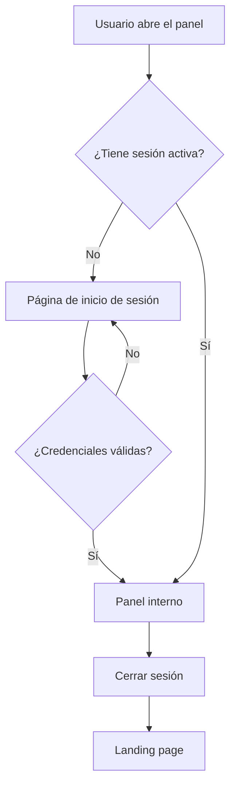

# Acceso Interno y Panel Principal

## 1. Propósito

Este documento describe la implementación del acceso autenticado y del panel principal de la aplicación de novedades de remuneraciones.

El objetivo es impedir que usuarios sin autorización consulten la información interna del sistema y proporcionar un espacio inicial desde el cual se puedan administrar colaboradores, períodos y novedades.

## 2. Funcionalidades implementadas

Durante esta etapa se desarrollaron las siguientes funcionalidades:

- Página personalizada para iniciar sesión.
- Protección del panel mediante autenticación.
- Redirección automática al login cuando el usuario no tiene una sesión activa.
- Retorno al panel después de iniciar sesión correctamente.
- Cierre de sesión mediante una solicitud POST protegida con CSRF.
- Panel principal con información obtenida desde PostgreSQL.
- Diseño adaptable para computadores y dispositivos móviles.
- Enlaces internos hacia la API REST, la administración de Django y la landing page.
- Pruebas automáticas del flujo de autenticación.

## 3. Rutas principales

| Ruta | Nombre interno | Acceso | Propósito |
|---|---|---|---|
| `/` | `novedades:inicio` | Público | Mostrar la landing page del proyecto. |
| `/cuentas/login/` | `login` | Público | Permitir el inicio de sesión. |
| `/cuentas/logout/` | `logout` | Autenticado | Cerrar la sesión activa. |
| `/panel/` | `novedades:panel` | Autenticado | Mostrar el panel principal. |
| `/api/` | `api:api-root` | Autenticado | Acceder a la API REST. |
| `/admin/` | `admin:index` | Personal autorizado | Acceder a la administración de Django. |

## 4. Flujo de autenticación



Cuando un usuario sin sesión solicita `/panel/`, Django responde con una redirección hacia:

```text
/cuentas/login/?next=/panel/
```

El parámetro `next` conserva la dirección solicitada. Después de autenticar correctamente al usuario, Django lo devuelve a `/panel/`.

## 5. Configuración de Django

En `config/settings.py` se definieron las siguientes opciones:

```python
LOGIN_URL = "login"
LOGIN_REDIRECT_URL = "novedades:panel"
LOGOUT_REDIRECT_URL = "novedades:inicio"
```

Estas configuraciones establecen:

- La ruta utilizada para iniciar sesión.
- El destino predeterminado después de autenticar al usuario.
- El destino después de cerrar la sesión.

Las rutas de autenticación incluidas por Django se habilitaron en `config/urls.py` mediante:

```python
path("cuentas/", include("django.contrib.auth.urls")),
```

## 6. Protección del panel

La vista del panel utiliza el decorador `login_required`.

```python
@login_required
def panel(request):
    ...
```

Este decorador comprueba que el usuario tenga una sesión válida antes de ejecutar la vista.

Si el usuario no está autenticado, Django no entrega el contenido del panel y lo redirige al formulario de acceso.

## 7. Información mostrada en el panel

El panel consulta la base de datos y presenta los siguientes indicadores:

- Cantidad de colaboradores activos.
- Cantidad de períodos de liquidación abiertos.
- Cantidad de novedades en estado borrador.
- Cantidad de novedades validadas.
- Nombre del usuario autenticado.
- Fecha actual.

Los valores se obtienen mediante consultas realizadas con el ORM de Django sobre PostgreSQL.

Esto significa que las tarjetas no contienen números escritos manualmente: muestran el estado real de la información almacenada.

## 8. Plantillas implementadas

### 8.1. Página de inicio de sesión

Archivo:

```text
templates/registration/login.html
```

Contiene:

- Formulario de nombre de usuario y contraseña.
- Token CSRF.
- Mensajes para credenciales incorrectas.
- Campo oculto `next`.
- Información básica de seguridad.
- Diseño adaptable a dispositivos móviles.

### 8.2. Plantilla base interna

Archivo:

```text
templates/novedades/base_interno.html
```

Define la estructura común del área privada:

- Menú lateral para computadores.
- Encabezado y navegación para celulares.
- Identificación del usuario activo.
- Enlaces hacia el panel, la API, la administración y la landing.
- Formulario para cerrar sesión.
- Bloque reutilizable para el contenido de las páginas internas.

### 8.3. Panel principal

Archivo:

```text
templates/novedades/panel.html
```

Extiende la plantilla base interna y muestra:

- Mensaje de bienvenida.
- Fecha actual.
- Resumen general del sistema.
- Indicadores consultados desde PostgreSQL.
- Descripción del flujo mensual.
- Accesos hacia las herramientas disponibles.

## 9. Cierre seguro de sesión

El cierre de sesión se realiza mediante un formulario con método POST:

```html
<form method="post" action="">
    
    <button type="submit">Salir</button>
</form>
```

No se utiliza un enlace GET para cerrar sesión.

El token CSRF ayuda a evitar que otro sitio provoque el cierre de sesión del usuario sin su autorización.

## 10. Diseño adaptable

El acceso interno fue probado con una resolución móvil de:

```text
390 × 844 píxeles
```

En dispositivos pequeños:

- El menú lateral de escritorio desaparece.
- Se muestra un encabezado móvil.
- Los accesos principales se organizan horizontalmente.
- Las tarjetas se presentan una debajo de otra.
- El formulario de inicio de sesión utiliza el ancho disponible.
- No se genera desplazamiento horizontal.

## 11. Pruebas automáticas

Se creó el archivo:

```text
novedades/test_autenticacion.py
```

Las pruebas verifican:

1. Que la página de login responda correctamente.
2. Que el panel rechace usuarios no autenticados.
3. Que un usuario autenticado pueda acceder al panel.
4. Que los indicadores iniciales se muestren correctamente.
5. Que un login válido respete el parámetro `next`.
6. Que credenciales incorrectas no autentiquen al usuario.
7. Que el cierre de sesión vuelva a proteger el panel.
8. Que los tres botones de acceso interno de la landing dirijan al panel.

También se actualizó una prueba antigua de la landing que todavía esperaba un enlace directo hacia `/admin/`.

Después de la actualización se ejecutaron correctamente:

```text
25 pruebas automáticas
```

## 12. Seguridad aplicada

La implementación utiliza las siguientes medidas:

- Autenticación integrada de Django.
- Contraseñas almacenadas mediante hash.
- Sesiones administradas por Django.
- Protección del panel con `login_required`.
- Protección CSRF en formularios POST.
- Cierre de sesión mediante POST.
- Acceso restringido a las funcionalidades internas.
- Ausencia de contraseñas y datos reales en el repositorio.
- Pruebas realizadas exclusivamente con información ficticia.

## 13. Archivos principales

| Archivo | Responsabilidad |
|---|---|
| `config/settings.py` | Configuración de las redirecciones de autenticación. |
| `config/urls.py` | Inclusión de las rutas de autenticación de Django. |
| `novedades/views.py` | Vista protegida y consultas del panel. |
| `novedades/urls.py` | Ruta `/panel/`. |
| `templates/registration/login.html` | Formulario personalizado de acceso. |
| `templates/novedades/base_interno.html` | Estructura visual del área privada. |
| `templates/novedades/panel.html` | Contenido del panel principal. |
| `templates/novedades/inicio.html` | Enlaces desde la landing hacia el panel. |
| `novedades/test_autenticacion.py` | Pruebas del acceso interno. |
| `novedades/test_landing.py` | Pruebas actualizadas de la landing. |
| `static/novedades/css/landing.css` | Estilos compilados utilizados por las páginas. |

## 14. Explicación para la sustentación

El acceso interno funciona utilizando el sistema de autenticación incluido en Django.

Cuando una persona intenta abrir el panel, el decorador `login_required` verifica si existe una sesión autenticada. Si no existe, Django envía al usuario al formulario de login y conserva la ruta original mediante el parámetro `next`.

Si las credenciales son válidas, Django crea la sesión y permite abrir el panel. La vista consulta PostgreSQL mediante el ORM y envía los resultados a la plantilla. Finalmente, el usuario puede cerrar su sesión con un formulario POST protegido mediante CSRF.

De esta manera, la landing page sigue siendo pública, pero la información operativa permanece dentro de un área autenticada.