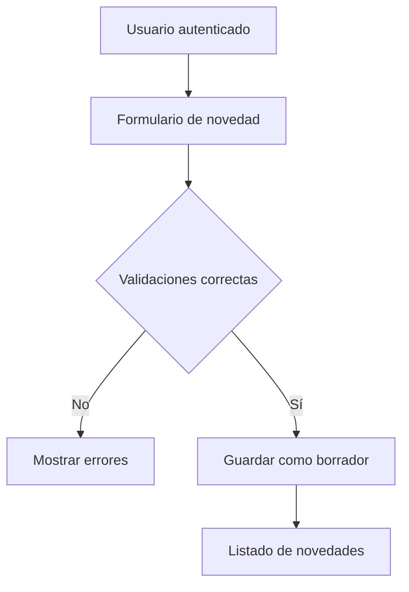

# Módulo de Captura y Consulta de Novedades

## 1. Propósito

Este documento describe el primer módulo funcional de la interfaz interna del sistema de novedades de remuneraciones.

El módulo permite que un usuario autenticado pueda:

- Consultar las novedades registradas.
- Buscar registros por colaborador, RUT o tipo de novedad.
- Filtrar por estado y período.
- Registrar una nueva novedad.
- Aplicar validaciones según el tipo de información.
- Guardar automáticamente el usuario responsable.
- Mantener los registros nuevos en estado borrador.

La funcionalidad fue desarrollada el 22 de agosto de 2026 como parte del Día 9 del proyecto.

## 2. Rutas implementadas

| Funcionalidad | Método | Ruta | Nombre |
|---|---|---|---|
| Listar novedades | GET | `/novedades/` | `novedades:lista_novedades` |
| Mostrar formulario | GET | `/novedades/nueva/` | `novedades:crear_novedad` |
| Guardar novedad | POST | `/novedades/nueva/` | `novedades:crear_novedad` |

Las dos rutas utilizan el decorador `login_required`.

Cuando un usuario no autenticado intenta ingresar, Django lo redirige al formulario de inicio de sesión y conserva la ruta solicitada mediante el parámetro `next`.

## 3. Flujo general



## 4. Formulario de captura

El formulario se encuentra definido en:

`novedades/forms.py`

Se utiliza un `ModelForm` llamado `NovedadForm`, relacionado directamente con el modelo `Novedad`.

### Campos visibles

| Campo | Propósito |
|---|---|
| `periodo` | Identifica el período mensual de remuneraciones. |
| `colaborador` | Identifica a la persona relacionada con la novedad. |
| `tipo_novedad` | Define si corresponde a bono, horas extras u otra novedad. |
| `fecha_inicio` | Fecha inicial cuando existe un evento definido. |
| `fecha_termino` | Fecha final cuando existe un rango de fechas. |
| `cantidad` | Registra días, minutos u otras cantidades. |
| `monto` | Registra valores monetarios en pesos. |
| `observacion` | Guarda información adicional. |

### Campos no expuestos

Los siguientes campos no aparecen en el formulario:

- `estado`
- `creado_por`
- `validado_por`
- `creado_en`
- `actualizado_en`

Estos valores no deben ser controlados libremente por el usuario porque forman parte del estado y la trazabilidad del registro.

## 5. Opciones habilitadas

El formulario muestra únicamente:

- Períodos abiertos.
- Colaboradores activos.
- Tipos de novedad activos.

Esto impide utilizar registros cerrados o deshabilitados en nuevas novedades.

## 6. Validaciones de negocio

### 6.1. Período abierto

La novedad solamente puede registrarse en un período cuyo estado sea `ABIERTO`.

### 6.2. Sucursal del colaborador

El colaborador debe pertenecer a la misma sucursal asociada con el período seleccionado.

### 6.3. Fechas

Cuando se ingresan ambas fechas, la fecha de término no puede ser anterior a la fecha de inicio.

### 6.4. Novedades monetarias

Cuando la unidad del tipo de novedad es `PESOS`, el campo `monto` es obligatorio.

Ejemplos:

- Bonos.
- Descuentos.
- Anticipos.
- Préstamos.
- Colación.
- Movilización.

### 6.5. Novedades cuantificables

Cuando la unidad es `DIAS` o `MINUTOS`, el campo `cantidad` es obligatorio.

Ejemplos:

- Horas extras.
- Inasistencias.
- Vacaciones.
- Licencias médicas.
- Días trabajados.

### 6.6. Valores no negativos

Las restricciones del modelo y de PostgreSQL impiden guardar cantidades o montos negativos.

## 7. Estado inicial y trazabilidad

Cuando el formulario es válido, la vista utiliza:

```python
novedad = formulario.save(commit=False)
novedad.creado_por = request.user
novedad.estado = Novedad.Estado.BORRADOR
novedad.save()
```

`commit=False` permite crear temporalmente el objeto sin guardarlo inmediatamente.

Antes de guardar se asignan dos valores controlados por el sistema:

- El usuario autenticado queda registrado en `creado_por`.
- La novedad queda inicialmente en estado `BORRADOR`.

De esta manera, un usuario no puede atribuir el registro a otra persona ni marcarlo directamente como validado.

## 8. Protección CSRF

El formulario utiliza:

```django

```

El token CSRF permite que Django verifique que la solicitud `POST` se originó desde el formulario legítimo de la aplicación.

Esto ayuda a impedir que otro sitio web envíe solicitudes en nombre del usuario autenticado.

## 9. Listado de novedades

La vista `lista_novedades` consulta PostgreSQL mediante el ORM de Django.

Se utiliza `select_related` para obtener en una misma consulta las relaciones necesarias:

- Período.
- Sucursal.
- Colaborador.
- Tipo de novedad.
- Usuario creador.
- Usuario validador.

Esto evita consultas repetitivas innecesarias al construir el listado.

## 10. Búsqueda y filtros

El listado permite buscar por:

- Nombres.
- Apellidos.
- RUT.
- Nombre del tipo de novedad.

También permite filtrar por:

- Estado.
- Período.

Los valores se envían mediante parámetros `GET`.

Ejemplo:

```text
/novedades/?q=ana&estado=BORRADOR&periodo=1
```

El uso de `GET` permite conservar los filtros en la dirección del navegador.

## 11. Paginación

El listado utiliza el paginador incluido en Django:

```python
paginador = Paginator(registros, 15)
```

Cada página puede mostrar hasta 15 novedades.

Los enlaces de navegación conservan la búsqueda y los filtros seleccionados.

## 12. Mensajes de confirmación

Después de guardar una novedad se utiliza el sistema de mensajes de Django para informar:

```text
La novedad fue registrada correctamente como borrador.
```

Posteriormente, el usuario es redirigido al listado de novedades.

Esta redirección evita que el formulario vuelva a enviarse accidentalmente al recargar la página.

## 13. Diseño adaptable

La interfaz fue desarrollada con Tailwind CSS 4.

### Escritorio

En pantallas grandes, los registros se muestran dentro de una tabla con las siguientes columnas:

- Colaborador.
- Período.
- Tipo.
- Fechas.
- Valor.
- Estado.
- Usuario creador.

### Dispositivos móviles

En celulares:

- La tabla se reemplaza por tarjetas verticales.
- Los filtros se muestran uno debajo de otro.
- La navegación interna se adapta al ancho disponible.
- No aparece desplazamiento horizontal.
- Los botones conservan un tamaño adecuado para interacción táctil.

La adaptación se verificó usando una resolución de `390 × 844`, correspondiente a un iPhone 12 Pro.

## 14. Datos ficticios utilizados

Para la comprobación manual se crearon datos completamente ficticios en PostgreSQL:

- Una sucursal de demostración.
- Una AFP de demostración.
- Una institución de salud de demostración.
- Una colaboradora llamada Ana Demostración.
- Un período abierto correspondiente a agosto de 2026.
- Un tipo de novedad monetaria.
- Un tipo de novedad medido en minutos.
- Un bono ficticio de $50.000.

Estos datos se encuentran solamente en la base de datos local y no forman parte del repositorio Git.

## 15. Pruebas manuales

Se comprobaron manualmente los siguientes comportamientos:

1. El formulario carga períodos, colaboradores y tipos habilitados.
2. Un bono sin monto es rechazado.
3. El mensaje de validación aparece junto al campo correspondiente.
4. Un bono con monto válido se guarda correctamente.
5. El registro queda en estado borrador.
6. El sistema registra automáticamente al usuario creador.
7. La búsqueda por nombre funciona.
8. Los filtros por estado y período funcionan.
9. El resultado aparece como tabla en escritorio.
10. El resultado aparece como tarjeta en dispositivos móviles.

## 16. Pruebas automáticas

Se creó el archivo:

`novedades/test_captura.py`

Este archivo contiene seis pruebas automáticas:

1. Las rutas requieren autenticación.
2. El formulario muestra opciones habilitadas.
3. Un bono sin monto es rechazado.
4. Las horas extras sin cantidad son rechazadas.
5. Un registro válido conserva estado y trazabilidad.
6. El listado permite buscar y filtrar.

Después de incorporar estas pruebas, el proyecto cuenta con:

```text
31 pruebas automáticas aprobadas
```

## 17. Archivos principales

| Archivo | Responsabilidad |
|---|---|
| `novedades/forms.py` | Define el formulario y sus validaciones. |
| `novedades/views.py` | Procesa el listado y la creación de novedades. |
| `novedades/urls.py` | Define las rutas del módulo. |
| `novedades/test_captura.py` | Contiene las pruebas automáticas. |
| `templates/novedades/lista_novedades.html` | Presenta búsqueda, filtros y resultados. |
| `templates/novedades/crear_novedad.html` | Presenta el formulario de captura. |
| `templates/novedades/base_interno.html` | Incorpora el acceso al módulo en la navegación. |
| `static/novedades/css/landing.css` | Contiene el CSS generado por Tailwind. |

## 18. Funcionalidades pendientes

Este módulo todavía no permite:

- Editar novedades existentes.
- Validar novedades.
- Anular novedades.
- Eliminar registros.
- Exportar la información.
- Administrar colaboradores desde la interfaz interna personalizada.

Estas funcionalidades serán desarrolladas en jornadas posteriores.

## 19. Explicación para la sustentación

El módulo utiliza una arquitectura por capas.

La plantilla HTML recibe los datos y presenta el formulario al usuario. La vista de Django procesa las solicitudes `GET` y `POST`. El `ModelForm` valida los campos y aplica reglas de negocio. El ORM transforma las operaciones de Python en consultas SQL y PostgreSQL almacena la información.

La autenticación determina quién puede ingresar. El token CSRF protege los formularios. El usuario creador se obtiene desde la sesión y no desde un campo editable. Finalmente, cada novedad se guarda como borrador para que pueda ser revisada antes de considerarse validada.