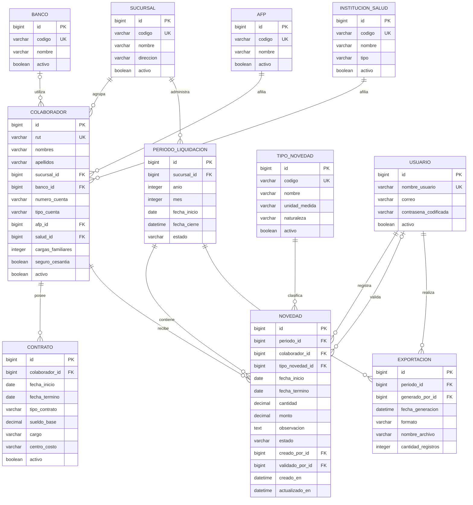

# Modelo Entidad-Relación

## 1. Propósito

Este documento presenta el modelo de datos inicial de la aplicación web para la gestión de novedades de remuneraciones de Alimentos Rancagua SpA.

El modelo busca reemplazar el registro manual y repetitivo realizado actualmente en Excel por una base de datos estructurada que permita almacenar colaboradores, contratos, entidades previsionales, períodos mensuales y novedades de remuneraciones.

## 2. Fuentes analizadas

Para diseñar el modelo se analizaron las siguientes fuentes del proceso actual:

- La planilla Excel utilizada para registrar la información de los colaboradores, asistencia, horas extras, bonos, descuentos, licencias y vacaciones.
- Las hojas `RESUMEN`, `Planilla de Remuneraciones` y `HORAS EXTRAS`.
- Las liquidaciones de sueldo generadas posteriormente por Nubox.
- Los requerimientos establecidos para el Taller ABP del curso Lenguajes de Programación para la Web.

Los archivos originales no serán almacenados en el repositorio público porque contienen información personal, bancaria, previsional y salarial real.

## 3. Alcance del modelo

La aplicación permitirá:

- Registrar y actualizar colaboradores.
- Asociar cada colaborador con una sucursal.
- Registrar información contractual.
- Relacionar bancos, AFP e instituciones de salud.
- Crear períodos mensuales de liquidación.
- Registrar novedades correspondientes a cada colaborador y período.
- Registrar horas extras, días trabajados, inasistencias, licencias médicas, vacaciones y feriados.
- Registrar bonos, colación, movilización, comisiones, descuentos, préstamos y anticipos.
- Validar la información antes de exportarla.
- Generar archivos para entregar la información a contabilidad.

## 4. Límites del alcance

En esta primera versión, la aplicación no realizará el cálculo legal completo de una liquidación de sueldo.

Los cálculos de cotizaciones previsionales, salud, impuesto único, gratificación legal, seguro de cesantía, total imponible, total tributable y alcance líquido continuarán siendo procesados por contabilidad mediante Nubox.

El PDF de liquidaciones se utiliza como referencia para comprender el resultado final del proceso, pero la aplicación se concentrará en capturar, validar y exportar correctamente la información de entrada.

## 5. Problemas identificados en el proceso actual

El análisis de la planilla permitió identificar los siguientes problemas:

- La información de los colaboradores se repite en diferentes hojas.
- Las novedades se registran manualmente en numerosas celdas.
- Las horas extras dependen de fórmulas entre hojas.
- Existen diferencias de período entre algunas secciones de la planilla.
- Los estados diarios se representan mediante colores y marcas que pueden interpretarse incorrectamente.
- Es posible introducir fechas, horas o montos con formatos diferentes.
- La información personal y bancaria puede quedar expuesta al compartir el archivo.
- No existe un historial estructurado de modificaciones.
- La generación mensual depende de revisar manualmente cada colaborador.

El modelo de datos busca solucionar estos problemas mediante entidades relacionadas, validaciones y trazabilidad.

## 6. Entidades principales

Después de analizar el proceso actual, se definieron las siguientes entidades para la primera versión de la aplicación.

### 6.1. Sucursal

Representa la sede o establecimiento al que pertenecen los colaboradores. Aunque inicialmente se utilizará la sucursal de Rancagua, esta entidad permitirá incorporar otras sucursales sin modificar la estructura del sistema.

Información principal:

- Código interno.
- Nombre.
- Dirección.
- Estado activo o inactivo.

### 6.2. Banco

Catálogo de instituciones bancarias disponibles para el pago de remuneraciones.

Información principal:

- Nombre del banco.
- Código.
- Estado activo o inactivo.

Un banco puede estar relacionado con muchos colaboradores.

### 6.3. AFP

Catálogo de administradoras de fondos de pensiones.

Información principal:

- Nombre de la AFP.
- Código.
- Estado activo o inactivo.

Una AFP puede estar relacionada con muchos colaboradores.

### 6.4. Institución de salud

Catálogo de instituciones de salud previsional, incluyendo FONASA e ISAPRE.

Información principal:

- Nombre.
- Tipo de institución.
- Código.
- Estado activo o inactivo.

Una institución de salud puede estar relacionada con muchos colaboradores.

### 6.5. Colaborador

Representa a cada trabajador registrado en la aplicación.

Información principal:

- RUT.
- Nombres.
- Apellidos.
- Sucursal.
- Banco.
- Número de cuenta bancaria.
- Tipo de cuenta bancaria.
- AFP.
- Institución de salud.
- Número de cargas familiares.
- Indicación de seguro de cesantía.
- Estado activo o inactivo.

Los datos reales de los colaboradores no se almacenarán en el repositorio público.

### 6.6. Contrato

Almacena la información laboral de cada colaborador y permite conservar su historial contractual.

Información principal:

- Colaborador.
- Fecha de inicio.
- Fecha de término, cuando corresponda.
- Tipo de contrato.
- Sueldo base.
- Cargo.
- Centro de costo.
- Estado del contrato.

Un colaborador puede tener varios contratos históricos, pero solamente uno debería permanecer activo al mismo tiempo.

### 6.7. Período de liquidación

Representa el mes y año para el cual se registran las novedades.

Información principal:

- Sucursal.
- Año.
- Mes.
- Fecha de inicio.
- Fecha de cierre.
- Estado del período.

Los estados iniciales serán:

- Abierto.
- Cerrado.
- Exportado.

Cada combinación de sucursal, año y mes deberá ser única.

### 6.8. Tipo de novedad

Catálogo que define las diferentes novedades que pueden registrarse.

Ejemplos:

- Días trabajados.
- Horas extras.
- Inasistencia.
- Licencia médica.
- Vacaciones.
- Feriado.
- Bono.
- Colación.
- Movilización.
- Comisión.
- Descuento.
- Préstamo.
- Anticipo.

Cada tipo de novedad indicará su unidad de medida, por ejemplo días, minutos o pesos, y su naturaleza, como haber, descuento, asistencia o información.

### 6.9. Novedad

Representa una novedad concreta asociada con un colaborador dentro de un período de liquidación.

Información principal:

- Colaborador.
- Período de liquidación.
- Tipo de novedad.
- Fecha de inicio.
- Fecha de término.
- Cantidad.
- Monto.
- Observación.
- Estado.
- Usuario que realizó el registro.
- Fecha y hora de creación.
- Fecha y hora de actualización.

Las horas extras se almacenarán de manera precisa y no como texto libre. La interfaz podrá recibirlas en formato de horas y minutos, pero el sistema las convertirá a una unidad uniforme para realizar validaciones y exportaciones.

### 6.10. Exportación

Registra los archivos generados para entregar las novedades a contabilidad.

Información principal:

- Período de liquidación.
- Fecha y hora de generación.
- Formato del archivo.
- Nombre del archivo.
- Cantidad de registros.
- Usuario que realizó la exportación.

Esta entidad permitirá conservar la trazabilidad de los reportes generados.

## 7. Usuario y control de acceso

La autenticación será administrada mediante el sistema de usuarios incluido en Django.

Los usuarios podrán tener permisos diferentes para:

- Consultar información.
- Registrar novedades.
- Modificar novedades.
- Validar novedades.
- Cerrar períodos.
- Generar exportaciones.

Las contraseñas no se almacenarán directamente y nunca se publicarán credenciales en GitHub.

## 8. Diagrama entidad-relación

El siguiente diagrama representa las entidades principales, sus atributos y las relaciones propuestas para la primera versión de la aplicación.

## 9. Cardinalidades principales

| Relación | Cardinalidad | Explicación |
|---|---|---|
| Sucursal - Colaborador | Uno a muchos | Una sucursal puede tener muchos colaboradores y cada colaborador pertenece a una sucursal. |
| Banco - Colaborador | Uno a muchos, opcional | Un banco puede ser utilizado por muchos colaboradores y un colaborador puede no tener banco registrado. |
| AFP - Colaborador | Uno a muchos | Una AFP puede estar asociada con muchos colaboradores. |
| Institución de salud - Colaborador | Uno a muchos | Una institución de salud puede estar asociada con muchos colaboradores. |
| Colaborador - Contrato | Uno a muchos | Un colaborador puede conservar varios contratos históricos. |
| Sucursal - Período de liquidación | Uno a muchos | Cada sucursal puede tener diferentes períodos mensuales. |
| Período de liquidación - Novedad | Uno a muchos | Un período puede contener muchas novedades. |
| Colaborador - Novedad | Uno a muchos | Un colaborador puede tener diferentes novedades durante cada período. |
| Tipo de novedad - Novedad | Uno a muchos | Un tipo puede clasificar muchas novedades. |
| Período de liquidación - Exportación | Uno a muchos | Un período puede generar varias versiones de exportación. |
| Usuario - Novedad | Uno a muchos | Un usuario puede registrar y validar varias novedades. |
| Usuario - Exportación | Uno a muchos | Un usuario puede generar diferentes exportaciones. |

## 10. Decisiones de diseño

### 10.1. Catálogo único de tipos de novedad

No se creará una tabla independiente para cada clase de novedad. Las horas extras, licencias, vacaciones, bonos y descuentos utilizarán la entidad `Novedad` y se diferenciarán mediante `TipoNovedad`.

Esto evita duplicar tablas y facilita agregar nuevos tipos en el futuro.

### 10.2. Conservación del historial contractual

Los contratos no se reemplazarán al producirse un cambio. El contrato anterior quedará inactivo y se creará uno nuevo, permitiendo consultar el historial laboral del colaborador.

### 10.3. Uso de catálogos

Los bancos, AFP, instituciones de salud y tipos de novedad serán catálogos administrables. Los registros utilizados anteriormente no se eliminarán; se marcarán como inactivos.

### 10.4. Separación por períodos

Cada novedad estará asociada con un período mensual. Esto evitará mezclar información de meses diferentes y permitirá cerrar un período antes de enviarlo a contabilidad.

### 10.5. Trazabilidad

Las novedades y exportaciones conservarán el usuario y la fecha de la operación. De esta forma será posible determinar quién registró, validó o exportó la información.

### 10.6. Protección de la información

El repositorio contendrá solamente la estructura de la aplicación y datos ficticios. Los documentos reales de Excel, liquidaciones, RUT, cuentas bancarias y remuneraciones no se publicarán.